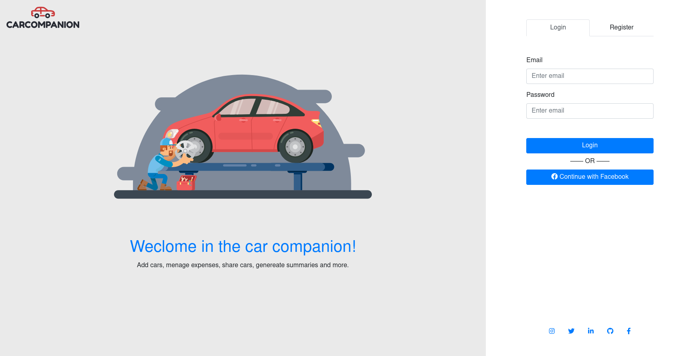
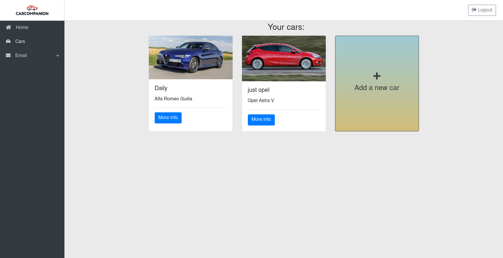
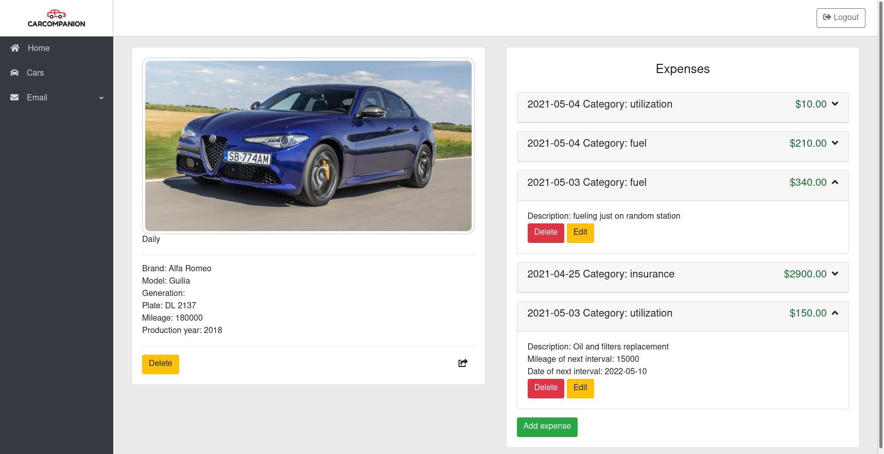
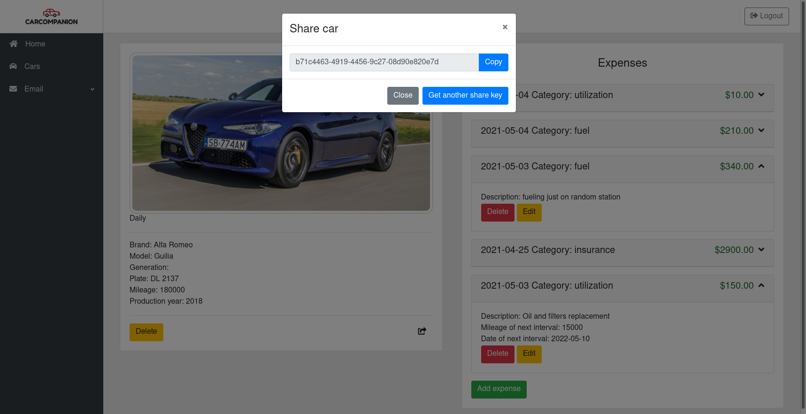

# Car-Companion

Car-companion is a web application to manage cars and its expenses. You can also share cars with others or see charts, figures and statistics about specific cars.

## About project

Project isn’t finished and won’t be maintained anymore. I’m not proud of this project because there are some mistakes and it would take a long time to fix and clean this. For example I have mixed a model and controller layers and there are no tests. I haven’t used the Identity library in order to make all these users stuff by myself to see how It can be build. Also it was my first experience with UI building (Blazor) and frontend development in general. 

## Used technologies and libraries 
Backend: 
- .NET core 3.1
- Entity framework core
- Automapper
- Serilog
- Swagger

Frontend:
- .NET 5
- Blazor WebAssembly
- Blazorise

## Installation

Use the [docker and docker-compose](https://www.docker.com/) to run frontend and backend of the application.

run this command in main repository folder:
```bash
docker-compose up -d
```

## Usage

When containers are up, you might to wait a while to apply migrations and some other necessary stuff by docker to get application ready for work.
Now when everything is done you can access the application, backend endpoint in swagger on [http://localhost:8080](http://localhost:8080) and frontend on [http://localhost:4200](http://localhost:4200)

## Functionalities

|                     |                          | Backend        | Frontend       |
|     :---:           |     :---                 |     :---:      | :---:          |
| Authorization       | Registration             | ✔️             | ✔️             |
|                     | JWT Access token         | ✔️             | ✔️             |
|                     | Refreshing Token         | ✔️             | ❌             |
|                     | Facebook Auth            | ✔️             | ❌             |
|                     | Logout                   | ✔️             | ✔️             |
| Car management      | Create car               | ✔️             | ✔️             |
|                     | Get all user cars        | ✔️             | ✔️             |
|                     | Get specific car         | ✔️             | ✔️             |
|                     | Edit car                 | ✔️             | ✔️             |
|                     | Delete car               | ✔️             | ✔️             |
| Expense management  | Get all expenses         | ✔️             | ✔️             |
|                     | Get specific expense     | ✔️             | ✔️             |
|                     | Add expense              | ✔️             | ✔️             |
|                     | Edit expense             | ✔️             | ✔️             |
|                     | Delete expense           | ✔️             | ✔️             |
| Car sharing         | Create share key         | ✔️             | ✔️             |
|                     | Use share key            | ✔️             | ✔️             |
|                     | Roles - permissions      | ❌             | ❌             |
| Logs                | Get all logs (superuser) | ⚠️             | ❌             |
|                     | Get my logs (user)       | ⚠️             | ❌             |
| Summaries           | Get summaries            | ✔️             | ➖             |
|                     | Charts                   | ➖             | ❌             |
|                     | Figures                  | ➖             | ❌             |

- ✔️ - work 
- ❌ - not implemented 
- ⚠️ - not finished 
- ➖ - doesn't involve 

## Few images from the UI application

Login page:



User cars:



Car expenses:



Share key:



## License
[MIT](https://choosealicense.com/licenses/mit/)
